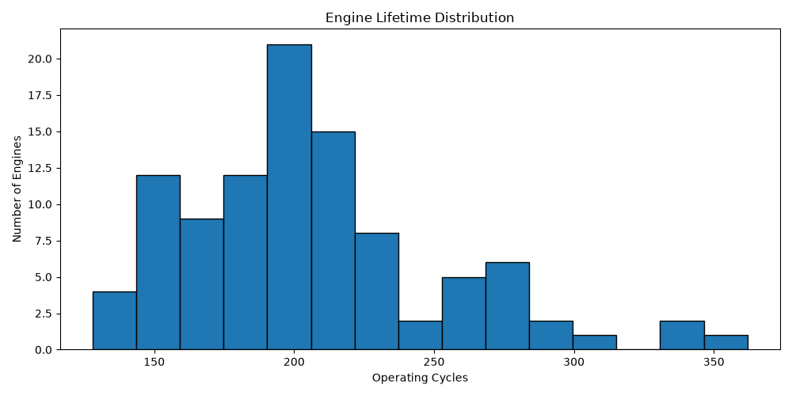
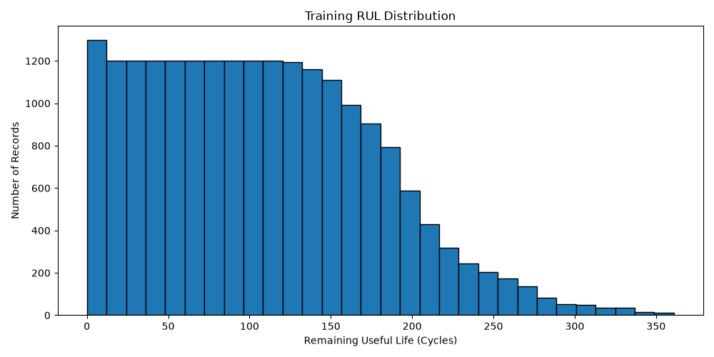
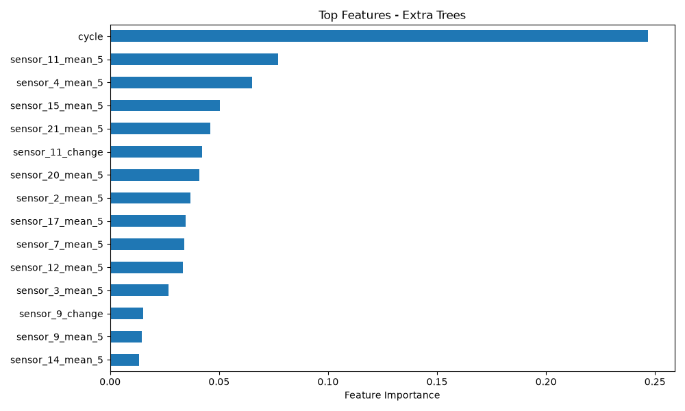
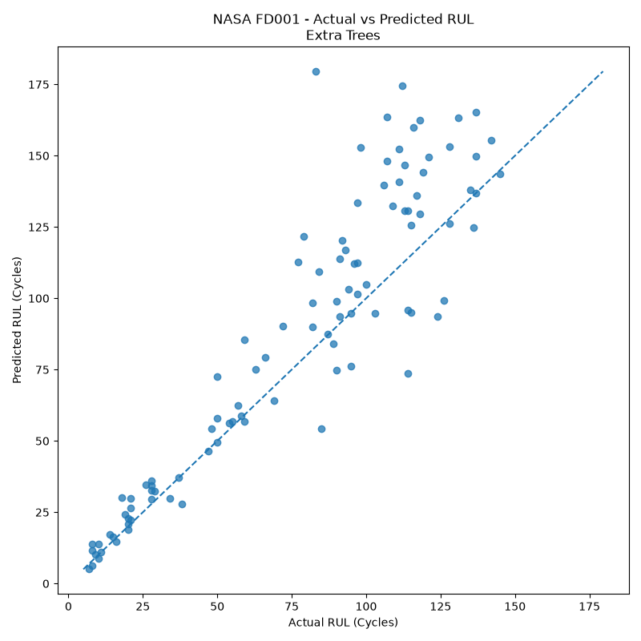
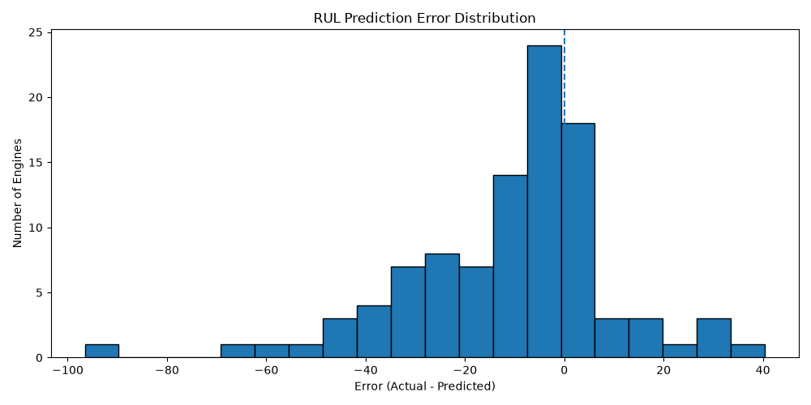
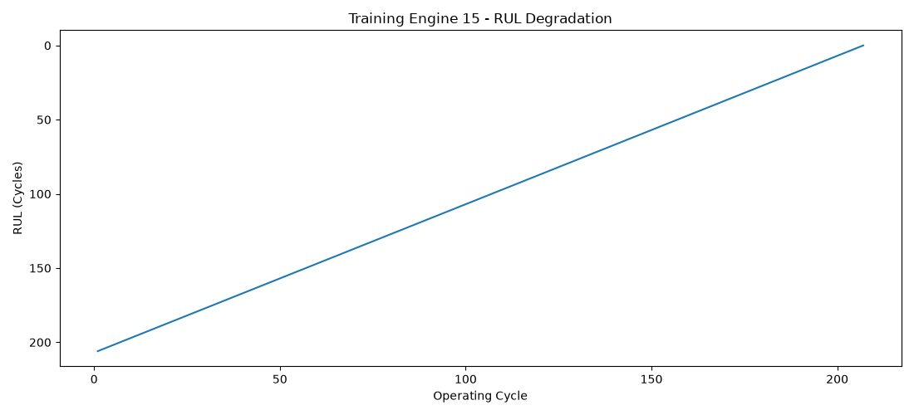

# NASA C-MAPSS Remaining Useful Life Prediction

A machine learning project that predicts the **Remaining Useful Life (RUL)** of aircraft engines using NASA's C-MAPSS FD001 turbofan engine dataset.

## 🎯 Project Objective

The main question behind this project is:

> **How many operating cycles does an aircraft engine have left before failure?**

Instead of waiting for an engine to fail, the model uses historical operating cycles and sensor measurements to estimate its remaining useful life.

---

## 📊 Dataset

This project uses the **NASA C-MAPSS FD001** dataset.

FD001 contains:

- 100 training engines
- 100 test engines
- 21 sensor measurements
- 3 operating settings
- Multiple operating cycles for each engine
- RUL targets for evaluation

---

## 🔎 Project Workflow

```text
NASA Raw Data
      ↓
Data Quality Checks
      ↓
Exploratory Data Analysis
      ↓
RUL Target Creation
      ↓
Sensor Analysis
      ↓
Feature Engineering
      ↓
Model Training
      ↓
Model Comparison
      ↓
Unseen Test Evaluation
      ↓
RUL Prediction
```

---

## 🛠️ Feature Engineering

To capture engine degradation, the project uses features such as:

- Operating cycle
- Rolling sensor averages
- Rolling sensor standard deviation
- Sensor trends
- Sensor changes from the engine's starting condition

These features help the model understand both **engine age** and **changes in sensor behavior**.

---

## 🤖 Models Evaluated

The project compares multiple machine learning models:

| Model | Purpose |
|---|---|
| Random Forest | Non-linear baseline |
| Extra Trees | Ensemble regression |
| HistGradientBoosting | Gradient boosting approach |

The models were evaluated using:

- MAE
- RMSE
- R²

---
### 📌 Final Takeaways

| Metric | Result |
|---|---:|
| **Best Model** | Extra Trees Regressor |
| **MAE** | **15.72 cycles** |
| **RMSE** | **22.90 cycles** |
| **R² Score** | **0.696** |
| **Test Engines** | **100** |

The final model predicts Remaining Useful Life with an average error of approximately **16 operating cycles** on the unseen FD001 test engines.

### 💡 What I Learned

This project showed me that a good machine learning solution is not only about selecting an algorithm. The most important parts were understanding the raw sensor data, creating a meaningful RUL target, engineering degradation-related features, validating at the engine level, and interpreting the final predictions.
---

## 📈 Key Findings

### 1. Operating cycle was highly important

The engine's operating cycle was the strongest feature used by the final model.

This makes sense because engine age provides important information about remaining life.

### 2. Sensor behavior also matters

Several rolling sensor features appeared among the most important model features.

This shows that the model is using more than just engine age to estimate degradation.

### 3. Extra Trees performed best

Among the tested models, Extra Trees provided the strongest final performance on the unseen FD001 test engines.

---

## 📊 Project Visualizations

### 1. Engine Lifetime Distribution


### 2. Training RUL Distribution


### 3. Feature Importance


### 4. Actual vs Predicted RUL


### 5. Model Performance Comparison


### 6. Engine RUL Degradation


---

## 💻 Technologies Used

```text
Python
Pandas
NumPy
Matplotlib
Scikit-learn
Machine Learning
Feature Engineering
Predictive Maintenance
```

---

## 📁 Project Structure

```text
NASA-CMAPSS-RUL-Prediction/
│
├── rul_prediction.py
├── train_FD001.txt
├── test_FD001.txt
├── RUL_FD001.txt
├── requirements.txt
├── README.md
│
└── outputs/
    ├── predictions/
    └── figures/
```

---

## 🚀 How to Run

Install the required libraries:

```bash
pip install -r requirements.txt
```

Then run:

```bash
python rul_prediction.py
```

The script processes the NASA data, creates the RUL target, performs feature engineering, trains the models, evaluates them and generates the final predictions.

---

## 💡 Why RUL Prediction Matters

Remaining Useful Life prediction is an important predictive-maintenance problem.

In a real-world environment, estimating the remaining life of equipment can help organizations:

- Plan maintenance earlier
- Reduce unexpected downtime
- Improve spare-parts planning
- Support condition-based maintenance
- Improve asset utilization

---

## 🔮 Future Improvements

The project can be extended by:

- Testing NASA FD002
- Testing NASA FD003
- Testing NASA FD004
- Hyperparameter optimization
- XGBoost comparison
- SHAP model explainability
- LSTM/GRU time-series models
- Deployment through an API
- Building a Power BI monitoring dashboard

---

## 👤 Author

**Karthick Raj**

Business Analyst | Data Analyst | BI Analyst

This project was developed as a practical machine learning and predictive-maintenance portfolio project.
